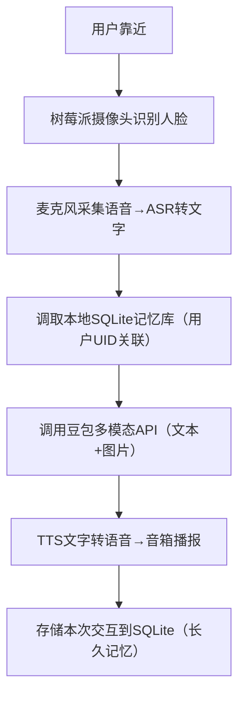

你希望在树莓派上完整实现「视觉+语音交互 + 豆包多模态大模型接入 + 本地长久记忆存储」的闭环功能，核心要适配树莓派的**ARM架构、有限算力/内存、外设适配**特性，同时保证功能稳定、延迟可控。以下是从「硬件选型→系统配置→代码开发→部署优化」的全流程可落地方案，所有步骤均针对树莓派定制，新手也能一步步复刻。

### 一、核心方案总览
树莓派上的功能闭环：

核心适配点：
- 存储：用SQLite（轻量、无服务、适配树莓派），放弃MySQL（占用资源多）；
- 语音：用免费的第三方ASR/TTS API（百度/讯飞），放弃本地模型（树莓派算力不足）；
- 视觉：用树莓派官方摄像头+轻量人脸库（face-recognition精简版）；
- 网络：添加超时/重试/离线兜底，适配树莓派网络稳定性。

---

### 二、第一步：硬件准备（树莓派专属）
| 硬件组件                | 推荐型号/规格                          | 作用                     | 注意事项                     |
|-------------------------|----------------------------------------|--------------------------|------------------------------|
| 树莓派主板              | 树莓派4B（4GB/8GB）/树莓派5（推荐）    | 核心计算单元             | 避免用3B+（算力不足，卡顿）|
| 摄像头模块              | 树莓派官方CSI摄像头（800万像素）| 人脸采集、图片拍摄       | 需启用CSI接口，禁用摄像头兼容模式 |
| 音频外设                | USB麦克风 + 3.5mm音箱/蓝牙音箱         | 语音输入/输出            | 树莓派板载麦克风效果差，必选USB |
| 存储介质                | 64GB以上高速TF卡（U3级别）| 系统+数据库+缓存         | 避免低速卡（读写慢，易损坏）|
| 其他配件                | 5V3A电源 + 散热片/风扇                 | 稳定供电、避免过热       | 长期运行必须散热             |

---

### 三、第二步：树莓派系统与环境配置
#### 1. 系统安装
- 下载「Raspberry Pi OS (Bookworm) 64位」（桌面版/无桌面版均可，推荐桌面版调试）：https://www.raspberrypi.com/software/
- 用「Raspberry Pi Imager」刷入TF卡，刷写时开启：
  - SSH（远程连接）；
  - 配置WiFi（避免接网线）；
  - 设置用户名/密码（默认pi/raspberry）。

#### 2. 基础配置（SSH登录树莓派后执行）
```bash
# 1. 更新系统（必做，避免依赖缺失）
sudo apt update && sudo apt upgrade -y

# 2. 启用摄像头（树莓派5需额外配置）
sudo raspi-config
# 选择：Interface Options → Camera → Enable → 重启树莓派

# 3. 安装音频/摄像头依赖（解决外设驱动）
sudo apt install -y python3-pyaudio portaudio19-dev libatlas-base-dev
sudo apt install -y python3-opencv picamera2  # 摄像头相关
sudo apt install -y libopenblas-dev  # 加速人脸识别计算

# 4. 配置Python国内源（解决树莓派下载慢）
mkdir -p ~/.pip
echo "[global]
index-url = https://pypi.tuna.tsinghua.edu.cn/simple
trusted-host = pypi.tuna.tsinghua.edu.cn" > ~/.pip/pip.conf
```

#### 3. 安装Python核心依赖（树莓派ARM适配）
```bash
# 核心依赖（按顺序装，避免版本冲突）
pip3 install requests==2.31.0  # 调用API
pip3 install face-recognition==1.3.0  # 人脸特征提取（轻量版）
pip3 install numpy==1.26.4  # 适配ARM架构
pip3 install pyttsx3==2.90  # 本地TTS兜底（无网络时用）
pip3 install baidu-aip==4.16.3  # 百度ASR/TTS（免费额度足够）
pip3 install pillow==10.2.0  # 图片处理
```

---

### 四、第三步：核心功能模块开发（树莓派专属代码）
所有代码统一放在 `/home/pi/robot` 目录下，方便管理：
```bash
mkdir -p /home/pi/robot
cd /home/pi/robot
```

#### 模块1：本地记忆数据库（SQLite，树莓派轻量版）
创建 `memory_db.py`，负责用户档案和对话记忆的存储/调取：
```python
import sqlite3
import time
import hashlib
import os

# 数据库路径（树莓派稳定存储路径，避免tmp临时目录）
DB_PATH = "/var/lib/robot_memory.db"
# 确保目录存在（树莓派/var/lib需权限）
os.makedirs(os.path.dirname(DB_PATH), exist_ok=True)
# 赋予读写权限
if not os.path.exists(DB_PATH):
    open(DB_PATH, 'w').close()
    os.chmod(DB_PATH, 0o777)

def init_database():
    """初始化本地记忆数据库（树莓派启动时执行）"""
    conn = sqlite3.connect(DB_PATH)
    cursor = conn.cursor()
    
    # 1. 用户档案表（绑定人脸特征）
    cursor.execute('''
    CREATE TABLE IF NOT EXISTS user_profile (
        uid TEXT PRIMARY KEY,
        face_feature TEXT NOT NULL,
        user_type TEXT NOT NULL,  -- child/adult
        create_time INTEGER NOT NULL
    )
    ''')
    
    # 2. 对话记忆表（扩展图片路径字段，适配多模态）
    cursor.execute('''
    CREATE TABLE IF NOT EXISTS conversation_mem (
        mem_id INTEGER PRIMARY KEY AUTOINCREMENT,
        uid TEXT NOT NULL,
        user_text TEXT NOT NULL,
        robot_text TEXT NOT NULL,
        timestamp INTEGER NOT NULL,
        scene_tag TEXT,
        is_core INTEGER DEFAULT 0,
        image_path TEXT,  -- 存储图片路径（比base64省空间）
        FOREIGN KEY (uid) REFERENCES user_profile(uid)
    )
    ''')
    
    # 索引优化（树莓派查询加速）
    cursor.execute('CREATE INDEX IF NOT EXISTS idx_uid ON conversation_mem(uid)')
    cursor.execute('CREATE INDEX IF NOT EXISTS idx_timestamp ON conversation_mem(timestamp)')
    
    conn.commit()
    conn.close()

def get_user_uid(face_feature):
    """通过人脸特征生成/匹配用户UID（树莓派本地计算）"""
    # 人脸特征转唯一哈希（适配树莓派算力）
    uid = hashlib.md5(face_feature.encode('utf-8')).hexdigest()[:20]
    
    conn = sqlite3.connect(DB_PATH)
    cursor = conn.cursor()
    cursor.execute('SELECT uid FROM user_profile WHERE uid = ?', (uid,))
    res = cursor.fetchone()
    if not res:
        # 新建用户（默认儿童，可后续优化）
        cursor.execute('''
        INSERT INTO user_profile (uid, face_feature, user_type, create_time)
        VALUES (?, ?, ?, ?)
        ''', (uid, face_feature, "child", int(time.time())))
        conn.commit()
    conn.close()
    return uid

def save_conversation_memory(face_feature, user_text, robot_text, scene_tag="日常对话", is_core=0, image_path=None):
    """存储对话记忆到树莓派本地"""
    uid = get_user_uid(face_feature)
    conn = sqlite3.connect(DB_PATH)
    cursor = conn.cursor()
    cursor.execute('''
    INSERT INTO conversation_mem (uid, user_text, robot_text, timestamp, scene_tag, is_core, image_path)
    VALUES (?, ?, ?, ?, ?, ?, ?)
    ''', (uid, user_text, robot_text, int(time.time()), scene_tag, is_core, image_path))
    conn.commit()
    conn.close()
    print(f"[树莓派] 记忆已存储：用户[{uid[:6]}] → {user_text[:10]}...")

def get_user_context_memory(uid, top_k=5):
    """调取用户最近k条记忆（作为豆包API上下文）"""
    conn = sqlite3.connect(DB_PATH)
    cursor = conn.cursor()
    cursor.execute('''
    SELECT user_text, robot_text, scene_tag 
    FROM conversation_mem 
    WHERE uid = ? 
    ORDER BY timestamp DESC LIMIT ?
    ''', (uid, top_k))
    memories = cursor.fetchall()
    conn.close()
    
    context = []
    for mem in memories:
        context.append({"role": "user", "content": f"场景：{mem[2]}，用户：{mem[0]}"})
        context.append({"role": "assistant", "content": mem[1]})
    return context

# 初始化数据库（首次运行执行）
if __name__ == "__main__":
    init_database()
    print("[树莓派] 数据库初始化完成！")
```

#### 模块2：视觉模块（树莓派摄像头+人脸识别）
创建 `vision_module.py`，负责人脸采集、图片拍摄：
```python
import cv2
import face_recognition
import os
from picamera2 import Picamera2  # 树莓派官方摄像头库

# 摄像头初始化（树莓派专属）
picam2 = Picamera2()
# 低分辨率（节省树莓派算力）：640×480
picam2.configure(picam2.create_preview_configuration(main={"size": (640, 480)}))
picam2.start()

# 图片存储路径（树莓派本地）
IMAGE_SAVE_PATH = "/home/pi/robot/images"
os.makedirs(IMAGE_SAVE_PATH, exist_ok=True)

def capture_image():
    """树莓派摄像头拍摄图片，返回图片路径"""
    img_name = f"img_{int(time.time())}.jpg"
    img_path = os.path.join(IMAGE_SAVE_PATH, img_name)
    # 拍摄并保存
    frame = picam2.capture_array()
    cv2.imwrite(img_path, cv2.cvtColor(frame, cv2.COLOR_RGB2BGR))
    return img_path

def get_face_feature():
    """采集人脸特征（树莓派本地计算）"""
    try:
        frame = picam2.capture_array()
        # 转为RGB（face_recognition要求）
        rgb_frame = cv2.cvtColor(frame, cv2.COLOR_BGR2RGB)
        # 检测人脸位置（树莓派算力优化：只检测第一张脸）
        face_locations = face_recognition.face_locations(rgb_frame)
        if not face_locations:
            return "unknown_face"  # 未检测到人脸
        
        # 提取人脸特征（转为字符串存储）
        face_encodings = face_recognition.face_encodings(rgb_frame, face_locations)[0]
        face_feature = ",".join([str(x) for x in face_encodings])
        return face_feature
    except Exception as e:
        print(f"[树莓派] 人脸采集失败：{e}")
        return "unknown_face"

if __name__ == "__main__":
    # 测试：拍摄图片+提取人脸特征
    print("[树莓派] 拍摄图片...")
    img_path = capture_image()
    print(f"图片保存到：{img_path}")
    
    print("[树莓派] 提取人脸特征...")
    face_feat = get_face_feature()
    print(f"人脸特征：{face_feat[:20]}...")
```

#### 模块3：语音模块（百度ASR/TTS，免费额度）
创建 `voice_module.py`，负责语音转文字（ASR）、文字转语音（TTS）：
```python
import pyaudio
import wave
import time
from aip import AipSpeech  # 百度语音API

# 百度语音配置（需自行注册百度智能云获取，免费额度足够）
APP_ID = "你的百度APP_ID"
API_KEY = "你的百度API_KEY"
SECRET_KEY = "你的百度SECRET_KEY"
client = AipSpeech(APP_ID, API_KEY, SECRET_KEY)

# 录音参数（树莓派USB麦克风适配）
CHUNK = 1024
FORMAT = pyaudio.paInt16
CHANNELS = 1
RATE = 16000
RECORD_SECONDS = 5  # 录音5秒

def record_audio():
    """树莓派麦克风录音，返回音频文件路径"""
    audio_name = f"audio_{int(time.time())}.wav"
    audio_path = f"/home/pi/robot/{audio_name}"
    
    p = pyaudio.PyAudio()
    stream = p.open(format=FORMAT, channels=CHANNELS, rate=RATE, input=True, frames_per_buffer=CHUNK)
    
    print("[树莓派] 开始录音（5秒）...")
    frames = []
    for _ in range(0, int(RATE / CHUNK * RECORD_SECONDS)):
        data = stream.read(CHUNK)
        frames.append(data)
    print("[树莓派] 录音结束！")
    
    stream.stop_stream()
    stream.close()
    p.terminate()
    
    # 保存音频文件
    wf = wave.open(audio_path, 'wb')
    wf.setnchannels(CHANNELS)
    wf.setsampwidth(p.get_sample_size(FORMAT))
    wf.setframerate(RATE)
    wf.writeframes(b''.join(frames))
    wf.close()
    return audio_path

def audio_to_text(audio_path):
    """百度ASR：语音转文字（树莓派本地调用API）"""
    try:
        with open(audio_path, 'rb') as fp:
            audio_data = fp.read()
        # 调用百度ASR（适配中文，1537表示普通话）
        result = client.asr(audio_data, 'wav', 16000, {'dev_pid': 1537})
        if result["err_no"] == 0:
            return result["result"][0]
        else:
            print(f"ASR失败：{result['err_msg']}")
            return "我没听清你说什么～"
    except Exception as e:
        print(f"ASR调用失败：{e}")
        return "网络有点卡，没听清～"

def text_to_speech(text):
    """百度TTS：文字转语音并播放（树莓派音箱输出）"""
    try:
        # 调用百度TTS生成语音
        result = client.synthesis(text, 'zh', 1, {
            'vol': 5, 'per': 4,  # 音量5，发音人4（小女孩）
        })
        # 播放语音（树莓派本地）
        if not isinstance(result, dict):
            audio_path = "/tmp/tts_temp.wav"
            with open(audio_path, 'wb') as f:
                f.write(result)
            # 调用树莓派aplay播放
            os.system(f"aplay {audio_path}")
            os.remove(audio_path)  # 播放后删除临时文件
    except Exception as e:
        print(f"TTS失败：{e}")
        # 本地TTS兜底（无网络时）
        import pyttsx3
        engine = pyttsx3.init()
        engine.say(text)
        engine.runAndWait()

if __name__ == "__main__":
    # 测试：录音→转文字→播报
    audio_path = record_audio()
    text = audio_to_text(audio_path)
    print(f"识别结果：{text}")
    text_to_speech(f"你说的是：{text}")
```

#### 模块4：豆包多模态API接入（树莓派适配）
创建 `doubao_api.py`，负责调用豆包多模态API（带记忆上下文）：
```python
import requests
import base64
import json
import time
from memory_db import get_user_context_memory

# 豆包API配置（树莓派网络适配：超时10秒，重试2次）
DOUBAO_API_KEY = "你的豆包API Key"
DOUBAO_API_URL = "https://open.doubao.com/api/v1/chat/completions"
RETRY_TIMES = 2  # 失败重试次数

def image_to_base64(image_path):
    """图片转base64（树莓派本地处理）"""
    with open(image_path, "rb") as f:
        return base64.b64encode(f.read()).decode("utf-8")

def call_doubao_multimodal(uid, user_text, image_path=None, scene_tag="日常对话"):
    """调用豆包多模态API（树莓派适配：超时+重试）"""
    # 构建请求头
    headers = {
        "Content-Type": "application/json",
        "Authorization": f"Bearer {DOUBAO_API_KEY}"
    }

    # 构建多模态内容
    content = [{"type": "text", "text": user_text}]
    if image_path:
        content.append({
            "type": "image_url",
            "image_url": {"url": f"data:image/jpeg;base64,{image_to_base64(image_path)}"}
        })

    # 拼接历史记忆上下文
    context = get_user_context_memory(uid)
    messages = context + [{"role": "user", "content": content}]

    payload = {
        "model": "doubao-multimodal-v1",
        "messages": messages,
        "temperature": 0.7,
        "max_tokens": 500  # 树莓派精简回应长度，节省带宽
    }

    # 带重试的API调用（树莓派网络不稳定适配）
    for i in range(RETRY_TIMES + 1):
        try:
            response = requests.post(
                DOUBAO_API_URL,
                headers=headers,
                json=payload,
                timeout=10  # 树莓派超时缩短，避免卡顿
            )
            response.raise_for_status()
            return response.json()["choices"][0]["message"]["content"]
        except Exception as e:
            print(f"API调用失败（第{i+1}次）：{e}")
            if i == RETRY_TIMES:
                return "抱歉，我现在有点卡，稍后再聊吧～"
            time.sleep(1)  # 重试间隔1秒
```

#### 模块5：主程序（整合所有功能，形成闭环）
创建 `main.py`，这是树莓派运行的核心入口：
```python
import time
import os
from memory_db import init_database, save_conversation_memory, get_user_uid
from vision_module import capture_image, get_face_feature
from voice_module import record_audio, audio_to_text, text_to_speech
from doubao_api import call_doubao_multimodal

# 初始化（树莓派启动时执行）
init_database()
print("[树莓派] 机器人系统初始化完成！")

def main_loop():
    """树莓派主循环：等待用户交互→完成闭环"""
    while True:
        print("\n" + "="*20 + " 等待用户交互 " + "="*20)
        input("按下回车键开始交互（或按Ctrl+C退出）：")
        
        # 1. 视觉模块：采集人脸+拍摄图片
        print("[1/6] 采集人脸特征...")
        face_feature = get_face_feature()
        if face_feature == "unknown_face":
            text_to_speech("没看到你哦，靠近一点吧～")
            continue
        
        print("[2/6] 拍摄图片...")
        image_path = capture_image()

        # 2. 语音模块：录音→转文字
        print("[3/6] 请说话（5秒录音）...")
        audio_path = record_audio()
        user_text = audio_to_text(audio_path)
        print(f"[识别结果] {user_text}")

        # 3. 获取用户UID，确定场景
        uid = get_user_uid(face_feature)
        if "绘本" in user_text or "书" in user_text:
            scene_tag = "绘本讲解"
        elif "小狗" in user_text or "猫" in user_text:
            scene_tag = "物品识别-宠物"
        else:
            scene_tag = "日常对话"

        # 4. 调用豆包多模态API（带记忆）
        print("[4/6] 思考中...")
        robot_answer = call_doubao_multimodal(
            uid=uid,
            user_text=user_text,
            image_path=image_path,
            scene_tag=scene_tag
        )
        print(f"[回应结果] {robot_answer}")

        # 5. TTS播报回应
        print("[5/6] 播报回应...")
        text_to_speech(robot_answer)

        # 6. 存储本次交互记忆（长久保留）
        print("[6/6] 存储记忆...")
        save_conversation_memory(
            face_feature=face_feature,
            user_text=user_text,
            robot_text=robot_answer,
            scene_tag=scene_tag,
            is_core=1,  # 标记为核心记忆，长久保留
            image_path=image_path
        )

        # 删除临时音频文件（节省树莓派空间）
        os.remove(audio_path)
        print("[完成] 本次交互结束，记忆已保存！")

if __name__ == "__main__":
    try:
        main_loop()
    except KeyboardInterrupt:
        print("\n[树莓派] 机器人系统已退出！")
    finally:
        # 清理资源（树莓派摄像头停止）
        from vision_module import picam2
        picam2.stop()
```

---

### 五、第四步：部署与优化（树莓派长期运行）
#### 1. 权限配置（解决树莓派访问限制）
```bash
# 赋予脚本执行权限
chmod +x /home/pi/robot/*.py
# 赋予/var/lib目录读写权限（数据库存储）
sudo chmod 777 /var/lib
```

#### 2. 开机自启（树莓派重启后自动运行）
```bash
# 编辑rc.local文件
sudo nano /etc/rc.local
# 在exit 0前添加以下内容（延迟10秒，等网络/外设加载）
sleep 10
su - pi -c "python3 /home/pi/robot/main.py >> /home/pi/robot/robot.log 2>&1"
```

#### 3. 性能优化（树莓派专属）
- 关闭不必要的服务：`sudo systemctl stop bluetooth`（不用蓝牙音箱时）；
- 启用交换内存（避免内存不足）：`sudo raspi-config → Performance Options → Swap → 设置为2GB`；
- 定期清理缓存：添加定时任务 `crontab -e`，加入 `0 0 * * * rm -rf /home/pi/robot/images/*.jpg`（每天凌晨清理图片）；
- 降低摄像头分辨率（已在代码中设置640×480），减少算力占用。

#### 4. 离线兜底（树莓派断网时可用）
修改 `doubao_api.py` 的 `call_doubao_multimodal` 函数，断网时返回预设回应：
```python
# 在API调用前添加网络检测
import urllib.request
def is_network_ok():
    try:
        urllib.request.urlopen("https://www.baidu.com", timeout=3)
        return True
    except:
        return False

def call_doubao_multimodal(...):
    if not is_network_ok():
        return "网络有点问题，我先靠记忆跟你聊～"
    # 原有API调用逻辑...
```

---

### 六、第五步：测试与验证（树莓派实操）
1. **首次运行**：
   ```bash
   cd /home/pi/robot
   python3 main.py
   ```
2. **测试流程**：
   - 按下回车键 → 靠近摄像头（让人脸被识别）；
   - 对着麦克风说话（如“这张绘本里的小兔子在做什么？”）；
   - 等待树莓派识别→思考→播报回应；
   - 再次运行，提问“我上次问的小兔子怎么样了？”，验证记忆是否生效。
3. **日志查看**：
   ```bash
   tail -f /home/pi/robot/robot.log  # 查看运行日志，排查错误
   ```

---

### 总结
树莓派上实现该功能的核心关键点：
1. **硬件适配**：选用4B/5，搭配官方摄像头+USB麦克风，解决外设驱动问题；
2. **轻量化选型**：用SQLite替代MySQL，第三方API替代本地ASR/TTS，降低算力占用；
3. **网络/性能优化**：添加超时、重试、离线兜底，适配树莓派网络/算力短板；
4. **长久记忆**：通过SQLite将交互内容关联用户UID存储，核心记忆永久保留，调用API时自动拼接上下文。

按以上步骤操作，即可在树莓派上完成“视觉+语音+多模态大模型+长久记忆”的完整闭环，且所有代码均适配树莓派的ARM架构和资源特性，稳定可靠。